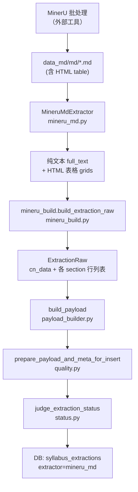

# MinerU MD 字段抽取方案说明

本文档描述当前 **MinerU-only、以 MD 为唯一输入** 的抽取链路：从 `data_md/md/*.md` 到入库 `payload` 的完整过程，以及每个字段的读取来源、映射规则与兜底逻辑。

> **extractor 名称**：`mineru_md`  
> **入口**：`syllabus-auditor prepare mineru`  
> **不参与**：pdfplumber、PyMuPDF、fusion

---

## 1. 总体流程



### 1.1 MD 文件里有什么

MinerU 输出的 MD 典型结构：

- `##` 标题：对应 PDF 章节（如「一、课程基本信息」「（四）教学内容」）
- 嵌入 **HTML `<table>`**：MinerU 把表格结构保留为 HTML（含 `rowspan` / `colspan`）
- 少量纯文本段落（如课程要求里的 numbered list）

`MineruMdExtractor` 做两件事：

| 步骤 | 函数 | 产出 |
|------|------|------|
| 抽表 | `_html_tables()` | 每个 `<table>` → `html_table_to_grid()` → 二维字符串网格 |
| 抽文 | `_plain_text()` | 去掉 HTML 标签与 `#` 标题标记，合并空白，得到 `full_text` |

页数估算：`full_text` 中 `^##\s+` 出现次数（至少为 1）。

### 1.2 表格预处理（所有表共用）

`normalize_mineru_tables()`（`mineru_table_normalize.py`）在解析前对每张表：

1. **标签-值粘连修复**（`repair_pair_table`）：MinerU 常把「开课（院）系人文」与「与艺术学院」拆进不同单元格；扫描行内文本，按 `课程编号`、`周学时` 等标签前缀拆成 `[标签, 值, 标签, 值, …]` 扁平行
2. **内容去重**：整表文本 hash 相同则跳过（避免 MD 里重复表）

HTML 网格展开（`html_table_to_grid`）：

- 用 BeautifulSoup 解析 `<tr>/<td>`
- 按 `rowspan` / `colspan` 展开到矩形 grid
- 合并格只在首格填文本，延续格为 `None`（后续解析可能产生「子行缺学时」等问题）

---

## 2. ExtractionRaw 构建顺序（mineru_build）

`build_extraction_raw()` 按 **固定顺序** 填充，后一步可补充前一步未填到的字段：

```
1. normalize_mineru_tables(tables)
2. _inject_section_anchors(full_text)     # 补「教学安排」「教学内容」等锚点
3. 遍历表 → 基本信息 / 学时 / 教师（pair 表）
4. parse_two_column_sections()            # 简介、课程目标等两列表
5. parse_section_tables()                 # 教学内容 / 教学安排 / 考核（不含课程要求表）
6. parse_course_goal_extras()               # 非标准「xx目标」扩展
7. parse_sections_from_text()               # 纯文本章节兜底
8. apply_khfsb_source()                     # 考核方式类型判别：table→tm / text→khgs
9. _fill_jcxx_from_text()                   # 正则补 jcxx
10. fill_overview_fallbacks()               # 无表时用概述字段
```

中间产物：

| ExtractionRaw 字段 | 含义 |
|--------------------|------|
| `cn_data` | 中文字段名 → 字符串（见 config `raw_cn_fields`） |
| `teaching_content` | 教学内容行（中文键：序号、主题、知识点、学时） |
| `course_schedule` | 教学安排行 |
| `assessment_rows` | 考核方式行 |
| `course_goal_extras` | 额外目标类键值 |
| `extraction_warnings` | 表头识别阶段的告警 |
| `full_text` | 全文（已注入锚点） |

---

## 3. Payload 顶层结构与字段总览

`build_payload()` 将 `ExtractionRaw` 转为审核用 JSON：

| Payload 键 | 中文含义 | 主要来源 |
|------------|----------|----------|
| `jcxx` | 课程基本信息 + 学时 + 教师 | pair 表 + 文本正则 |
| `kczwjj` | 课程中文简介 | 两列表 |
| `kcywjj` | 课程英文简介 | 两列表 |
| `ybzsyq` | 预备知识要求 | 两列表 / 文本章节 |
| `jcjydcl` | 教材及阅读材料 | 文本章节 `阅读材料` |
| `kcmb` | 课程目标 | 两列表 + 概述兜底 |
| `jxnr` | 教学内容 | section 表 + 概述兜底 |
| `jxap` | 教学安排 | section 表 + 概述兜底 |
| `kcyq` | 课程要求（纯文本） | 文本章节 |
| `khfsb` | 考核方式 | section 表 + 文本说明 |

---

## 4. 各字段读取方案（详细）

### 4.1 `jcxx` — 课程基本信息与学时、教师

**Payload 子字段映射**（`config.py` → `jcxx_field_map`）：

| Payload 键 | 中文标签 | 读取来源（优先级从高到低） |
|------------|----------|---------------------------|
| `kcbh` | 课程编号 | ① 含「课程编号」标签的 pair 表 ② 全文正则 `课程编号\s*[：:]\s*(\S+)` ③ 入库前校验：须匹配 `^[A-Za-z0-9][A-Za-z0-9._-]{2,31}$`，否则置空 |
| `kkyx` | 开课（院）系 | ① pair 表 ② 正则 `开课[（(]院[）)]系\s*[：:]\s*(.+?)` |
| `zwkcmc` | 中文课程名称 | ① pair 表 ② 正则 |
| `ywkcmc` | 英文课程名称 | ① pair 表 ② 正则 |
| `kcxz` | 课程性质 | pair 表 |
| `kclb` | 课程类别 | pair 表 |
| `skyy` | 授课语言 | pair 表 |
| `sfyxwxyxk` | 是否允许外学院选课 | pair 表（标签别名：允许外学院选课） |
| `khfs` | 考核方式（基本信息表内） | pair 表（与 `khfsb` 章节不同） |
| `zxs` | 周学时 | 含「周学时」「总学时」的 pair 表 |
| `skzs` | 上课周数 | 同上 |
| `zongxs` | 总学时 | 同上（注意：与 `jxnr.zongxs` 不同，此处来自基本信息表） |
| `jxxs` | 教学学时 | pair 表 |
| `syxs` | 实验学时 | pair 表 |
| `sjxs` | 实践学时 | pair 表 |
| `qtxs` | 其他学时 | pair 表 |
| `zxxs` | 自学学时 | pair 表 |
| `kcxf` | 课程学分 | pair 表 |
| `rkjsxm` | 任课教师姓名 | 教师 pair 表 ② 正则 |
| `jsgh` | 教师工号 | 教师表 |
| `email` | E-mail | 教师表 |
| `lxdh` | 联系电话 | 教师表 |

**Pair 表识别规则**（`mineru_build` 遍历 `all_tables`）：

| 触发条件 | 解析函数 |
|----------|----------|
| 表内同时出现标签「课程编号」 | `parse_pair_table()` |
| 表内同时出现「周学时」「总学时」 | `parse_pair_table()` |
| 表内同时出现「教师工号」「职称」且尚未解析过教师 | `parse_teacher()` |

`parse_pair_table` 逻辑：每行按 **相邻单元格 [标签, 值, 标签, 值, …]** 扫描；标签经 `normalize_label`（去空白）后匹配 `basic_pair_labels` 集合。

**MinerU 特有问题与修复**：

- MD 基本信息表常出现单元格粘连（如「中文课程名称现 | 代逻辑」）；`repair_pair_table` + `scan_row_label_pairs` 尝试从单行文本拆标签/值
- 若修复失败，中文名/院系/英文名仍可能错误或为空 → 依赖 `_fill_jcxx_from_text` 正则二次补全

**未进入 payload 但存在于 `cn_data` 的字段**（写入 `meta.unmapped_segments`）：

- `课程模块`、`职称`、`学历`（见 `config.meta.unmapped_cn_fields`）

---

### 4.2 `kczwjj` / `kcywjj` — 课程简介

| Payload 键 | 中文 | 读取方式 |
|------------|------|----------|
| `kczwjj` | 课程中文简介 | `parse_two_column_sections()`：表内某格标签为「课程中文简介」，同格或后续格为正文；跨行续写会 `join_text` 合并 |
| `kcywjj` | 课程英文简介 | 同上，标签「课程英文简介」 |

**两列表标签集合**（`two_column_section_labels`）：

`课程中文简介`、`课程英文简介`、`思政目标`、`能力目标`、`知识目标`、`预备知识要求`

识别逻辑：在 **列数 ≥ 2** 的表中，找第一个匹配标签的列索引，右侧所有列合并为值；若下一行首列为空，则视为上一标签的续行。

MinerU MD 中简介表常为 **单列大段文本**（首列为空、第二列为正文），也按「首列空 + 后续有内容 → 续写 current_label」处理。

---

### 4.3 `ybzsyq` — 预备知识要求

| 来源 | 说明 |
|------|------|
| 两列表 | 标签「预备知识要求」 |
| 文本兜底 | `parse_sections_from_text()`：在 `full_text` 中匹配标题「预备知识要求」，截取到下一章节标题之前 |

---

### 4.4 `kcmb` — 课程目标

| Payload 键 | 中文 | 读取方式 |
|------------|------|----------|
| `szmb` | 思政目标 | 两列表，标签「思政目标」 |
| `nlmb` | 能力目标 | 两列表 |
| `zsmb` | 知识目标 | 两列表 |
| `mbgs` | 目标概述 | 当 sz/nl/zs **三者皆空** 时，用 `cn_data["课程目标概述"]` |
| `kzzd` | 扩展目标 | `parse_course_goal_extras()`：2 列表中标签以「目标」结尾且不在 {思政,能力,知识,课程目标} 的项 |

**`课程目标概述` 文本兜底**：

- 条件：`思政目标`、`能力目标`、`知识目标` 均未从表读出
- 在 `full_text` 中提取「课程目标」章节正文 → 写入 `cn_data["课程目标概述"]` → payload 的 `mbgs`

---

### 4.5 `jxnr` — 教学内容

#### 4.5.1 表格式 `jxnr.tm`

由 `parse_section_tables()` 识别 **SectionProfile「教学内容」**：

**表头识别**（扫描表前 3 行）：

| 标准字段 | 可匹配表头别名（节选） |
|----------|------------------------|
| 序号 | 序号、编号、章节、章次 |
| 主题 | 主题、教学主题、单元、章节名称 |
| 知识点 | 知识点、教学内容、主要内容、讲授内容 |
| 学时 | 学时、课时、教学学时 |

至少命中 **2 个不同列** 且满足 `required`（主题、知识点）才认定为教学内容表。

**数据行规则**（`_append_rows`）：

- 若「序号」列值像序号（`is_sequence`：纯数字、第 N 周等）→ **新开一行**
- 否则 → **合并到上一行**（同一序号下多行主题/知识点）
- 含「课时总计 / 学时总计 / 合计」的行 → 剥离统计行，不当作数据行

**Payload 行映射**（`content_item_map`）：

| 原始键 | Payload 键 |
|--------|-------------|
| 序号 | `xh` |
| 主题 | `zt` |
| 知识点 | `zsd` |
| 学时 | `xs` |
| （未映射列） | `kzzd[]`：`{bt, nr}` |

#### 4.5.2 `jxnr.zongxs` — 教学内容总学时

优先级：

1. `full_text` 正则：`课时总计：N 学时`、`学时总计：N 学时`、`总学时：N`（见 `total_hours_patterns`）
2. 否则：对 `teaching_content` 各行「学时」为 **纯数字** 的求和

#### 4.5.3 `jxnr.nrgs` — 概述兜底

当 **`jxnr.tm` 为空** 时：

- `nrgs` = `cn_data["教学内容概述"]`
- `教学内容概述` 来自 `fill_overview_fallbacks()`：在 `full_text` 提取「教学内容」章节正文

---

### 4.6 `jxap` — 教学安排

#### 4.6.1 表格式 `jxap.tm`

**SectionProfile「教学安排」**，表头别名：

| 标准字段 | 可匹配表头别名（节选） |
|----------|------------------------|
| 序号 | 序号、**课程**、周次、课次 |
| 授课内容 | 授课内容、讲授内容、教学内容 |
| 授课方式 | 授课方式、教学方式、教学方法 |
| 作业 | 作业、作业测验、课后作业 |
| 思政元素的融入和预期教学成效 | 含「思政」「预期教学成效」「课程思政」等短语的列 |

**思政列特殊处理**（`payload_builder._promote_schedule_sz_cn`）：

1. 若标准列已有内容 → 直接用  
2. 否则从 `kzzd` 里找含「思政」的标签  
3. 否则从「授课内容」中按「思政」字样 **切分**：后半段 → `szyqjxx`，前半段 → `sknr`

**Payload 行映射**（`schedule_item_map`）：

| 原始键 | Payload 键 |
|--------|-------------|
| 序号 | `zs` |
| 授课内容 | `sknr` |
| 授课方式 | `skfs` |
| 作业 | `zy` |
| 思政元素的融入和预期教学成效 | `szyqjxx` |

#### 4.6.2 `jxap.apgs` — 概述兜底

当 **`jxap.tm` 为空** 时，`apgs` = `cn_data["课程安排概述"]`（从「教学安排」章节文本截取）。

#### 4.6.3 章节锚点

MinerU 文本里常见「（五）教学安排」无独立换行；`_inject_section_anchors()` 会先替换为 `\n教学安排\n`，便于文本兜底定位。

---

### 4.7 `khfsb` — 考核方式

读取阶段先做 **类型判别**（`apply_khfsb_source()`），`tm` 与 `khgs` **互斥**，不会同时填充：

| 判别结果 | 条件 | 写入 payload | `meta.section_extraction.khfsb_format` |
|----------|------|--------------|----------------------------------------|
| **table** | `parse_section_tables()` 识别到考核方式表且解析出 ≥1 行 | `khfsb.tm` 有行，`khgs=""` | `"table"` |
| **text** | 未识别到考核表 | `khfsb.tm=[]`，`khgs`=章节正文 | `"text"` |

判别在 `parse_sections_from_text()` 之后执行：若为 table，会 **清空** `cn_data["考核方式说明"]`，避免正文里的「考核方式」字样污染 `khgs`。

#### 4.7.1 表格式 → `khfsb.tm`

**SectionProfile「考核方式」**：

| 标准字段 | 表头别名（节选） |
|----------|------------------|
| 考试形式 | 考试形式、考核形式、考核环节 |
| 考察内容 | 考察内容、考核内容 |
| 考察方式 | 考察方式、评价方式 |
| 占比 | 占比、比例、权重 |

行规则：「考试形式」列有值 → 始终 **新开一行**（不合并）。

**Payload 映射**（`assessment_item_map`）：

| 原始键 | Payload 键 |
|--------|-------------|
| 考试形式 | `ksxs` |
| 考察内容 | `kcnr` |
| 考察方式 | `kcfs` |
| 占比 | `zb` |

#### 4.7.2 文本型 → `khfsb.khgs`

当 **未识别到考核表** 时：

- `khgs` = 在 `full_text` 中匹配「考核方式」章节正文（`prefer_last=True` 取最后一次出现）
- `tm` 保持空数组

**质检**：`tm` 为空但 `khgs` 有内容时，`quality.py` 记为 `overview_used_instead_of_table`（info），**不** 记 `empty_section` error。

---

### 4.8 `kcyq` — 课程要求（仅文本）

标准模板为 **编号列表纯文本**，payload 只写入顶层字段 `kcyq`，无 `kcyqb` 结构。

| Payload 键 | 来源 |
|------------|------|
| `kcyq` | `parse_sections_from_text()`：匹配「课程要求 / 学习要求 / 课堂要求」章节，截取到下一章节标题前 |

**读取逻辑**：

1. MD 去 HTML 标签后的 `full_text` 中定位 `## （六）课程要求` 等标题
2. `extract_section(text, "课程要求", stop_titles=...)` 提取正文
3. 写入 `cn_data["课程要求"]` → payload 的 `kcyq`

**质检**：`kcyq` 为空时报 `empty_section`（path: `payload.kcyq`）。

---

### 4.9 `jcjydcl` — 教材及阅读材料

| 来源 | 说明 |
|------|------|
| `cn_data["阅读材料"]` | `parse_sections_from_text()` 匹配标题「阅读材料」，截取到「课程要求 / 考核方式」等下一标题前 |

---

## 5. 入库前质检与状态

### 5.1 `build_completeness_warnings()`（quality.py）

在 `prepare_payload_and_meta_for_insert()` 中追加完整性告警。

**章节级**（`FIELD_LABELS`）：

| section | 检查字段 | 空则 reason |
|---------|----------|-------------|
| `jcxx` | kcbh, zwkcmc, ywkcmc, kkyx, rkjsxm | `missing_field` |
| `kcmb` | szmb, nlmb, zsmb | `missing_field` |
| `jxnr` / `jxap` / `khfsb` | `tm` | `empty_section`（若有 `nrgs`/`apgs`/`khgs` 概述则降为 `overview_used_instead_of_table` info） |

**行级**（每个 `tm[]` 元素逐列）：

| section | 必填列 |
|---------|--------|
| `jxnr.tm[]` | xh, zt, zsd, xs |
| `jxap.tm[]` | zs, sknr, skfs, szyqjxx |
| `khfsb.tm[]` | ksxs, kcnr, kcfs, zb |

有概述替代表时，行级告警 severity 降为 `warn`。

### 5.2 `judge_extraction_status()`（status.py）

| 条件 | 状态 |
|------|------|
| payload 为空 | `failed` |
| 存在 severity=error 的 extraction_warnings | `partial` |
| 缺 kcbh | `partial` |
| 缺课程目标（sz/nl/zs/mbgs 全空）或缺 jxnr（tm 与 nrgs 全空） | `partial` |
| 缺 jxap（tm 与 apgs 全空） | `partial` |
| 以上皆满足 | `success` |

---

## 6. 已知限制（MinerU MD 路径）

| 现象 | 原因 |
|------|------|
| jcxx 中文名/院系/英文名偶发错误 | MD 基本信息表单元格被 MinerU 截断；`repair_pair_table` 无法完全修复 |
| jxnr 子行「学时」为空 | HTML `rowspan` 展开后，续行无学时格；解析器将「序号=1」的子行当作新行 |
| khfsb 整节为空 | MD 中既无考核表、也无「考核方式」章节正文 |
| 思政列偶发空 | 表头被 MinerU 折行（如「思政元素的融入和预期教学成 效」）；依赖 `_field_for_header` 模糊匹配 |
| 课程编号校验过严 | 含空格或异常格式的编号会被 `_clean_course_code` 清空 |

---

## 7. 相关源码索引

| 文件 | 职责 |
|------|------|
| `src/syllabus_auditor/core/extractors/mineru_md.py` | MD 读入、抽表、抽文 |
| `src/syllabus_auditor/core/extractors/mineru_build.py` | 表格+文本 → ExtractionRaw |
| `src/syllabus_auditor/core/extractors/mineru_table_normalize.py` | HTML grid、pair 表修复、去重 |
| `src/syllabus_auditor/core/extractors/section_table_parser.py` | 四类 section 表识别与行合并 |
| `src/syllabus_auditor/core/extractors/pdfplumber.py` | pair/教师/两列/文本章节（MinerU 复用） |
| `src/syllabus_auditor/core/payload_builder.py` | ExtractionRaw → payload |
| `src/syllabus_auditor/core/quality.py` | 完整性告警 |
| `src/syllabus_auditor/core/status.py` | success / partial / failed |
| `config.py` | 字段映射、章节标题、正则模式 |
| `syllabus-auditor prepare mineru` | 批量 MD 入库 |
| MinerU 外部批处理 | 生成 `data_md/md/` |

---

## 8. 数据目录约定

```
data_md/
  md/           ← 入库输入（本方案唯一读取源）
  json/         ← MinerU 中间产物（当前不入库）
  manifest/     ← index.jsonl，每条 success 记录含 "md" 路径
```

Manifest 示例字段：

```json
{
  "stem": "2025-2026-2《现代逻辑》课程实施方案_朱敏",
  "source_pdf": "data_pdf/【人文】课程方案完整版/....pdf",
  "md": "data_md/md/....md",
  "status": "success"
}
```

入库时以 `source_pdf` 为 DB 主键路径，`md` 为抽取输入。
