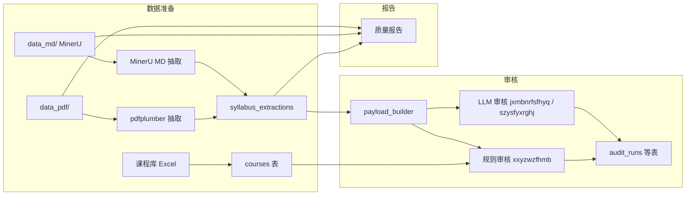

# Python 文件说明

本文档说明 `tests/` 与 `src/syllabus_auditor/` 下每个 `.py` 文件的用途。  
项目整体架构见 [项目结构说明.md](./项目结构说明.md)。

---

## 目录

- [tests/](#tests) — 单元测试与集成诊断（不参与主流程）
- [src/syllabus_auditor/](#srcsyllabus_auditor) — 主 Python 包
  - [cli.py](#cli)
  - [application/](#application)
  - [auditors/](#auditors)
  - [shared/](#shared)
  - [utils/](#utils)
  - [core/](#core)

---

## tests/

主流程入口为 CLI（`syllabus-auditor`）。`tests/` 仅用于验证与本地诊断。

| 目录 | 用途 |
|------|------|
| `tests/unit/` | 单元/回归测试，`pytest` 默认只跑这里 |
| `tests/integration/` | 需 DB 与 `data_pdf/` 的诊断脚本，手动 `python tests/integration/xxx.py` |

### integration/ — 诊断与修复

| 文件 | 用途 |
|------|------|
| `integration/audit_mineru_raw_coverage.py` | 审计 PDF 与 `_mineru_raw` stem 匹配覆盖率 |
| `integration/check_jxap_gap.py` | SQL 快速查看教学安排抽取分布 |
| `integration/compare_mineru_md_vs_pdf.py` | MinerU MD 与 PDF/DB 三方对比 |
| `integration/dedupe_pdf_stems.py` | 重复/尾部空格 stem 重命名方案 |
| `integration/diagnose_extract_deep.py` | MD 表格 vs 抽取深度对比 |
| `integration/diagnose_extract_failures.py` | extract_failure 误报明细 |
| `integration/diagnose_false_missing.py` | 抽取误报根因分析 |
| `integration/field_missing_compare_50.py` | 50 份 MD 缺失字段源文档核对 |
| `integration/fix_trailing_space_stems.py` | 修剪 PDF/_mineru_raw 尾部空格 |
| `integration/mineru_ocr_quality_report.py` | MinerU OCR 质量批量评估 |
| `integration/run_missing_analysis.py` | 清空库后批量 pdfplumber 缺失分析（破坏性） |
| `integration/run_missing_mineru_to_raw.py` | 对缺失 PDF 批量跑 MinerU |

已删除：`scripts/` 薄包装、`count_sz_fill`/`debug_sz_missing` 等一次性脚本、`test_pr1`/`test_pr2` PR 回归。

---

## src/syllabus_auditor/

主 Python 包，按分层组织：`application/` 编排流程，`core/` 抽取与审核引擎，`auditors/` 审核维度插件，`shared/` 配置与日志，`utils/` 通用工具。日常入口为 CLI。

```
cli → application/prepare → core/extractors + core/db
    → application/audit → auditors + core/audit
```

---

### cli

| 文件 | 用途 | 主要导出 |
|------|------|----------|
| `cli.py` | Typer 命令行入口，提供 `init-db`、`prepare`、`audit`、`report` 子命令及废弃命令的兼容转发 | `app`, `prepare_app`, `audit_app`, `report_app`, `main` |

**子命令概览：**

| 命令 | 对应模块 |
|------|----------|
| `syllabus-auditor init-db` | `core/db/init_db.py` |
| `syllabus-auditor prepare mineru` | `application/prepare/mineru.py` |
| `syllabus-auditor prepare courses` | `application/prepare/pdf.py` |
| `syllabus-auditor prepare course-library` | `application/prepare/course_library.py` |
| `syllabus-auditor audit run` | `application/audit/batch.py` |
| `syllabus-auditor report quality` | `application/report/quality.py` |

---

### application

应用编排层，负责 prepare（数据准备）、audit（批审）、report（质量报告）三大流水线。

| 文件 | 用途 | 主要导出 |
|------|------|----------|
| `application/__init__.py` | 应用层总入口，聚合 prepare / audit / report | `run_audit_batch`, `run_prepare_mineru`, `run_prepare_courses`, `run_prepare_course_library`, `run_quality_report` |
| `application/prepare/__init__.py` | 数据准备流水线包入口 | `find_course_library_excel`, `list_pdf_files`, `load_success_entries`, `prepare_*`, `run_prepare_*` |
| `application/prepare/course_library.py` | 读取课程库 Excel、列映射检测、写入 `courses` 表 | `detect_header_row`, `read_course_library_excel`, `find_course_library_excel`, `prepare_course_library`, `run_prepare_course_library` |
| `application/prepare/mineru.py` | 读取 MinerU manifest → MD 抽取 → 写入 `syllabus_extractions` | `load_success_entries`, `run_prepare_mineru` |
| `application/prepare/pdf.py` | 递归扫描 PDF，用 pdfplumber 抽取并入库 | `list_pdf_files`, `prepare_syllabus_pdfs`, `run_prepare_courses` |
| `application/audit/__init__.py` | 审核流水线包入口 | `run_audit_batch` |
| `application/audit/batch.py` | 批处理审核应用层封装，带结构化日志 | `run_audit_batch` |
| `application/report/__init__.py` | 报告流水线包入口 | `quality_report_main`, `run_quality_report` |
| `application/report/quality.py` | 只读质量报告：对比 MinerU/MD/DB/pdfplumber 各层数据，生成 `docs/data_quality_report.*` | `load_manifest`, `fetch_db`, `classify_warning`, `run_quality_report`, `main` |

---

### auditors

审核维度插件，每个文件对应一条审核规则（维度）。

| 文件 | 用途 | 主要导出 |
|------|------|----------|
| `auditors/__init__.py` | 审核维度实现包入口 | `AUDITORS`, `AUDITOR_BY_KEY`, `AuditorSpec`, `run_auditor`, `run_batch_audit` |
| `auditors/registry.py` | 审核维度注册表、配置校验与单维度调度 | `AuditorSpec`, `AUDITORS`, `AUDITOR_BY_KEY`, `RULE_AUDIT_KEYS`, `validate_audit_config`, `run_auditor` |
| `auditors/runner.py` | 批审调度器：多科目并发、续跑、LLM 维度并行 | `DEFAULT_AUDITORS`, `run_batch_audit` |
| `auditors/jxmbnrfsfhyq.py` | **LLM 维度**：教学目标/内容/方式是否符合要求（分项并行调用 LLM） | `audit_jxmbnrfsfhyq`, `build_audit_input` |
| `auditors/szysfyxrghj.py` | **LLM 维度**：思政元素是否有效融入各环节 | `audit_szysfyxrghj`, `build_audit_input` |
| `auditors/xxyzwzfhmb.py` | **规则维度**：信息要素完整、模板符合、中英文简介 | `audit_xxyzwzfhmb` |

**审核维度代码对照：**

| 代码 | 中文 | 实现文件 | 方式 |
|------|------|----------|------|
| `xxyzwzfhmb` | 信息要素完整符合模板是否有中英文简介 | `xxyzwzfhmb.py` | 规则 |
| `jxmbnrfsfhyq` | 教学目标内容方式是否符合要求 | `jxmbnrfsfhyq.py` | LLM |
| `szysfyxrghj` | 是否将思政元素有效融入各环节 | `szysfyxrghj.py` | LLM |

---

### shared

跨模块共享的配置、日志与文案工具。

| 文件 | 用途 | 主要导出 |
|------|------|----------|
| `shared/__init__.py` | 共享模块包标记 | — |
| `shared/config/__init__.py` | 配置对外入口 | `PAYLOAD_SCHEMA_VERSION`, `load_extraction_config`, `load_project_config`, `reload_config` |
| `shared/config/loader.py` | 读取 `project.yaml` 并叠 `schema.py`，构建运行时配置 dict | `load_project_config`, `load_extraction_config`, `reload_config` |
| `shared/config/schema.py` | 领域 schema：章节标题、字段映射、审核维度（低频变更） | `EXTRACTION_CONFIG`, `PAYLOAD_FIELD_MAP`, `AUDIT_SCHEMA` |
| `shared/logging.py` | JSON 行结构化日志 | `JsonFormatter`, `configure_logging`, `get_logger` |
| `shared/reason_text.py` | 将内部字段路径替换为客户可读的中文审核理由 | `INTERNAL_LABELS`, `clean_customer_reason`, `clean_customer_reasons` |

---

### utils

审核与抽取流程共用的辅助函数。

| 文件 | 用途 | 主要导出 |
|------|------|----------|
| `utils/__init__.py` | 审核通用工具聚合；文案常量从根目录 `project.yaml` 的 `audit_messages` / `content_layout_rules` 读取 | `CONTENT_LAYOUT_RULES`, `FALLBACK_REASON`, `JsonLlmClient`, `build_*_audit_data` 等 |
| `utils/data.py` | 通用数据清洗与空值判断 | `as_dict`, `as_list`, `is_empty`, `compact_text`, `looks_template_text` |
| `utils/llm_parse.py` | LLM 返回 JSON 的解析与理由合并 | `parse_llm_json`, `result_value`, `string_list`, `merge_reasons` |
| `utils/llm_protocol.py` | LLM 客户端协议接口（Protocol） | `JsonLlmClient` |
| `utils/meta_text.py` | 从 meta 原文提取片段与标签值 | `meta_text_sources`, `extract_page_keyword_segments`, `section_snippets`, `label_value` |
| `utils/payload_sections.py` | 为 LLM 审核构建各章节结构化输入（课程目标/教学内容/安排/方式） | `build_kcmb_audit_data`, `build_jxnr_audit_data`, `build_jxap_audit_data`, `build_jxfs_audit_data` |
| `utils/source_verify.py` | 在 MinerU MD 中回查抽取告警是否误报（从 diagnose 脚本迁入） | `FIELD_ALIASES`, `read_md_plain_text`, `verify_warning_in_md` |

---

### core

核心能力层：抽取引擎、payload 构建、规则审核、数据库访问、LLM 客户端。

#### 顶层模块

| 文件 | 用途 | 主要导出 |
|------|------|----------|
| `core/__init__.py` | 核心包占位 | — |
| `core/types.py` | 抽取与准备流程的数据类 | `ExtractionRaw`, `PrepareSummary`, `CourseLibrarySummary` |
| `core/audit.py` | 审核领域模型与规则引擎：课程库比对、学时/周次匹配、必填项检查等 | `AuditSubject`, `SubjectAudit`, `AuditRunSummary`, `audit_subject`, `refresh_subject_audit` |
| `core/audit_labels.py` | 审核维度代码与中文标签互转 | `AUDIT_WD_LABELS`, `audit_wd_label`, `audit_wd_code` |
| `core/content_layout.py` | 章节主字段 vs 概述/补充字段的布局判定（quality 与 LLM 共用） | `KCMB_GOAL_KEYS`, `TABLE_SECTIONS`, `section_content_layout`, `build_layout_context` |
| `core/field_mapping.py` | Excel 列名 → `courses` 表列的映射关系 | `EXCEL_TO_DB_COLUMN`, `COURSE_DB_COLUMNS` |
| `core/meta_builder.py` | 从 `ExtractionRaw` 构建入库 meta 与相对路径 | `build_meta`, `relative_source_path`, `UNMAPPED_CN_FIELDS` |
| `core/payload_builder.py` | 将 `ExtractionRaw` 映射为规范 payload JSON（章节字段结构化） | `build_payload` |
| `core/quality.py` | 入库前 payload/meta 清洗、完整性告警生成与 JSONB 安全化 | `FIELD_LABELS`, `build_completeness_warnings`, `prepare_payload_and_meta_for_insert` |
| `core/status.py` | 根据 payload 与告警判定抽取状态（success / partial / failed） | `judge_extraction_status` |
| `core/llm.py` | OpenAI 兼容 LLM 客户端与调用轨迹记录 | `LlmConfig`, `LlmClient`, `load_llm_client`, `build_llm_trace`, `first_llm_call` |

#### core/db/ — 数据库访问

| 文件 | 用途 | 主要导出 |
|------|------|----------|
| `core/db/__init__.py` | 数据库模块入口 | `EXPECTED_TABLES`, `build_dsn`, `CourseStore`, `ExtractionStore`, `init_database` |
| `core/db/connection.py` | 项目根目录定位与 PostgreSQL DSN 构建 | `get_project_root`, `build_dsn` |
| `core/db/init_db.py` | 执行 `schema.sql` 初始化数据库表结构 | `EXPECTED_TABLES`, `init_database`, `main` |
| `core/db/courses.py` | `courses` 表的 upsert 操作 | `CourseStore.upsert_many` |
| `core/db/extractions.py` | `syllabus_extractions` 表的读写 | `ExtractionStore.insert`, `ExtractionStore.has_successful_extraction` |
| `core/db/audit.py` | 审核运行与结果持久化（`audit_runs` / `audit_run_metrics` 等表） | `AuditStore`（`list_subjects`, `match_course`, `create_run`, `save_subject_audit`, `complete_run` 等） |

#### core/extractors/ — 抽取引擎

| 文件 | 用途 | 主要导出 |
|------|------|----------|
| `core/extractors/__init__.py` | 抽取器公共入口（pdfplumber + MinerU） | `BaseExtractor`, `MineruMdExtractor`, `PdfPlumberExtractor`, `build_extraction_raw`, `enhance_raw_extraction` |
| `core/extractors/base.py` | 抽取器抽象基类 | `BaseExtractor` |
| `core/extractors/section_table_parser.py` | 通用章节表格解析（教学内容/安排/考核等复杂表格） | `SectionProfile`, `parse_section_tables`, `parse_course_goal_extras`, `normalize_assessment_rows` |

**MinerU 抽取链路：**

| 文件 | 用途 | 主要导出 |
|------|------|----------|
| `core/extractors/mineru/__init__.py` | MinerU 抽取流程包入口 | `MineruMdExtractor`, `MineruMiddleExtractor`, `build_extraction_raw`, `assess_ocr_quality` |
| `core/extractors/mineru/md.py` | MinerU Markdown 读取：HTML 修复、middle 补格、OCR 质量评估 | `MineruMdExtractor`, `repair_md_html`, `html_tables_from_md`, `assess_ocr_quality` |
| `core/extractors/mineru/middle.py` | 从 MinerU `middle.json` 构建 `ExtractionRaw` | `MineruMiddleExtractor` |
| `core/extractors/mineru/process.py` | MinerU 结构化处理：HTML 表格→Raw、纯文本章节兜底 | `build_extraction_raw`, `apply_mineru_text_fallback` |
| `core/extractors/mineru/tables.py` | MinerU HTML 表格归一化与标签值对扫描 | `html_table_to_grid`, `scan_row_label_pairs`, `normalize_mineru_tables` |

**pdfplumber 抽取链路：**

| 文件 | 用途 | 主要导出 |
|------|------|----------|
| `core/extractors/pdfplumber/__init__.py` | pdfplumber 抽取流程包入口 | `PdfPlumberExtractor`, `enhance_raw_extraction`, `extract_layout` |
| `core/extractors/pdfplumber/extractor.py` | PDF 文本/表格抽取主实现 | `PdfPlumberExtractor`, `parse_pair_table`, `extract_section`, `parse_sections_from_text` |
| `core/extractors/pdfplumber/enhance.py` | 多源候选融合、文本兜底与章节增强 | `ExtractionCandidate`, `enhance_raw_extraction`, `parse_teaching_content`, `parse_course_schedule` |
| `core/extractors/pdfplumber/pymupdf_layout.py` | PyMuPDF 版面文本兜底（pdfplumber 无法识别时的补充） | `PageLayout`, `extract_layout`, `layout_to_text`, `PyMuPdfUnavailable` |

---

## 数据流简图



---

## 文件数量汇总

| 目录 | 文件数 | 说明 |
|------|--------|------|
| `tests/unit/` | 18 | 单元/回归测试 |
| `tests/integration/` | 12 | 集成诊断（手动运行） |
| `src/syllabus_auditor/` | 60 | 主 Python 包 |
| **合计** | **76** | |
